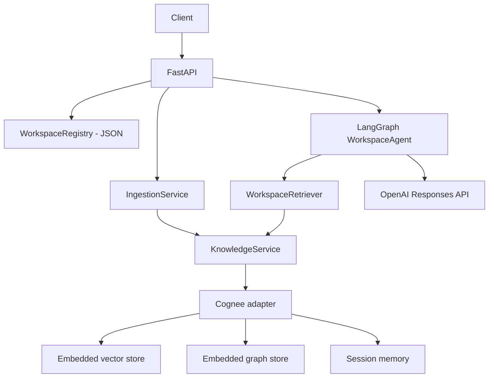

# Evidence-Driven Decision Intelligence Platform

An AI workspace for complex, evidence-driven decisions. A **workspace** is an
information/decision domain ("Should we enter the German solar market?"). It
ingests heterogeneous documents into a persistent knowledge layer and answers
questions against that evidence through a stateful LangGraph agent behind
FastAPI.

**Status: Phase 1.** The foundation is in place: workspaces, source-agnostic
ingestion, Cognee-backed knowledge + memory, and a small LangGraph Q&A flow.
The structured decision model (decisions, evidence, claims, assumptions, risks,
alternatives, contradiction detection, reassessment) is *not* implemented yet.

## Architecture



The application owns source normalization, retrieval coordination, orchestration
and HTTP schemas. Cognee owns embeddings, graph construction, retrieval and
persistent memory. LangGraph owns state and execution.

`KnowledgeService` (in `app/domain.py`) is the boundary the future decision
agent codes against: `ingest`, `semantic_search`, `graph_search`, `remember`,
`recall`. `CogneeKnowledgeService` is the only production implementation; tests
use an in-memory fake.

Agent flow (Phase 1):

```text
understand -> retrieve -> reason -> (at most one refined retrieval)
           -> respond -> update workspace/session memory
```

Only the visible question and answer are written to memory — never model
reasoning.

## Setup

Python 3.11 or 3.12.

```bash
python -m venv .venv
source .venv/bin/activate          # Windows: .venv\Scripts\activate
pip install -e ".[dev,cognee]"
cp .env.example .env
```

### LLM provider

The provider boundary lives in `app/config.py`. Setting `OPENROUTER_API_KEY`
selects OpenRouter for both the agent and Cognee; leaving it empty falls back to
`OPENAI_API_KEY`. `OPENROUTER_MODEL` defaults to `openai/gpt-oss-20b:free`.

OpenRouter is not one of Cognee's first-class providers, so the app maps it onto
Cognee's generic adapter:

| Cognee env var | Value set by the app |
| --- | --- |
| `LLM_PROVIDER` | `custom` |
| `LLM_MODEL` | `openrouter/openai/gpt-oss-20b:free` |
| `LLM_ENDPOINT` | `https://openrouter.ai/api/v1` |
| `LLM_API_KEY` | your `OPENROUTER_API_KEY` |

Any of these set in the environment beforehand wins — the app only fills blanks.

### Embeddings

Cognee configures embeddings separately from the LLM, and **OpenRouter has no
embeddings endpoint**. Embeddings therefore stay on OpenAI by default and need
an `OPENAI_API_KEY` with quota. To embed locally instead:

```bash
pip install -e ".[local-embeddings]"
```

then set in `.env`:

```
EMBEDDING_PROVIDER=fastembed
EMBEDDING_MODEL=sentence-transformers/all-MiniLM-L6-v2
EMBEDDING_DIMENSIONS=384
```

Cognee uses local embedded storage under `EDI_DATA_DIR` (default
`.decision_intelligence/`) — no Neo4j or other service is required. The embedded
stores are single-process, so run one Uvicorn worker.

`cognee` is an optional extra so the test suite installs and runs without it.
Running the real API requires it.

## Run

```bash
uvicorn app.main:app --reload --workers 1
```

Health check: `GET http://localhost:8000/health`

## API

| Method | Path | Purpose |
| --- | --- | --- |
| GET | `/health` | Liveness |
| POST | `/workspaces` | Create a workspace |
| GET | `/workspaces` | List workspaces |
| POST | `/workspaces/{workspace_id}/ingest` | Ingest documents / files / a GitHub repo |
| POST | `/workspaces/{workspace_id}/chat` | Ask a question against workspace knowledge |

```bash
curl -X POST http://localhost:8000/workspaces \
  -H "Content-Type: application/json" \
  -d '{"name":"Solar Market Analysis","description":"Should we enter the German solar market?"}'

curl -X POST http://localhost:8000/workspaces/solar-market-analysis/ingest \
  -H "Content-Type: application/json" \
  -d '{"paths":["./examples/solar"]}'

curl -X POST http://localhost:8000/workspaces/solar-market-analysis/chat \
  -H "Content-Type: application/json" \
  -d '{"message":"Which competitors depend on a single supplier?","session_id":"review-1"}'
```

Response shape:

```json
{
  "answer": "...",
  "sources": ["competitors.txt"],
  "retrieval": {"semantic_hits": 2, "graph_hits": 1, "memory_hits": 0}
}
```

## CLI

```bash
decision-intel create-workspace solar-market-analysis --name "Solar Market Analysis"
decision-intel ingest solar-market-analysis --path ./examples/solar
decision-intel ingest solar-market-analysis --github owner/repository
```

## Ingestion

Source-agnostic. Supported today: inline documents, local Markdown/TXT/text-PDF
files, whole directories, and a bounded read-only GitHub loader (metadata, tree,
up to 30 relevant files). GitHub is one source among many, not the product.

Every document preserves `source`, `file_name`, `document_type`, `location`
(path/URL) and `timestamp` where available; provenance is also embedded in the
text sent to Cognee so it survives into the graph.

## Workspaces

A workspace has `workspace_id` (slug), `name`, `description`, `created_at`, and
is persisted in a single JSON file under the data directory. Each workspace maps
to a Cognee dataset `workspace-{slug}`; memory is scoped to
`workspace:{id}:session:{session_id}`.

## Tests

```bash
pytest
pytest --cov=app --cov-report=term-missing
```

17 deterministic tests, no network and no API key: LLM provider resolution,
workspace creation and
persistence, ingestion, workspace-scoped retrieval, memory persist/recall,
LangGraph execution including the bounded retry, all four endpoints, file
loading with provenance, and Cognee-adapter call translation against a stub.

## Known limitations

- Scanned PDFs need OCR and are rejected when no text can be extracted.
- Embedded Cognee storage suits a single-process local/demo deployment.
- The LangGraph checkpointer is process-local; durable memory lives in Cognee.
- Real Cognee/OpenAI runs need credentials and are not part of the unit suite.

## Phase 2 (not started)

Introduce the structured decision state — `Decision`, `Evidence`, `Claim`,
`Assumption`, `Risk`, `Alternative` — persisted through Cognee, and extend the
LangGraph graph into the decision lifecycle (intake → retrieve → recall → gap
analysis → research → claim extraction → contradiction check → comparison →
recommendation → persistence).
