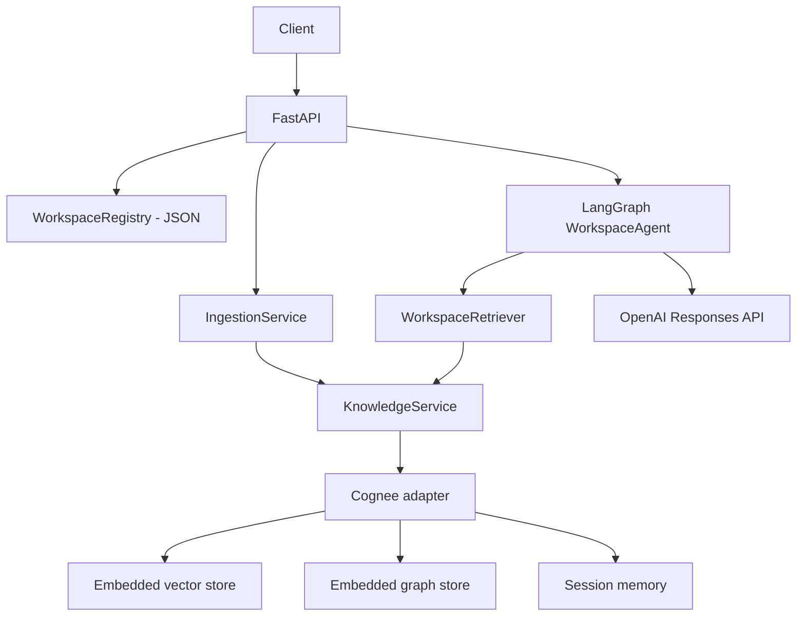

# Evidence-Driven Decision Intelligence Platform

An AI workspace for complex, evidence-driven decisions. A **workspace** is an
information/decision domain ("Should we enter the German solar market?"). It
ingests heterogeneous documents into a persistent knowledge layer and answers
questions against that evidence through a stateful LangGraph agent behind
FastAPI.

**Status: Phase 2.** On top of the Phase 1 foundation (workspaces,
source-agnostic ingestion, Cognee knowledge + memory, LangGraph Q&A) the system
now produces structured, evidence-backed decisions, remembers them, and can
reassess them against new knowledge. Contradiction detection and external
research tools are not implemented.

## Architecture



The application owns source normalization, retrieval coordination, orchestration
and HTTP schemas. Cognee owns embeddings, graph construction, retrieval and
persistent memory. LangGraph owns state and execution.

`KnowledgeService` (in `app/domain.py`) is the boundary the future decision
agent codes against: `ingest`, `semantic_search`, `graph_search`, `remember`,
`recall`. `CogneeKnowledgeService` is the only production implementation; tests
use an in-memory fake.

Agent flow (Phase 1):

```text
understand -> retrieve -> reason -> (at most one refined retrieval)
           -> respond -> update workspace/session memory
```

Only the visible question and answer are written to memory — never model
reasoning.

## Setup

Python 3.11 or 3.12.

```bash
python -m venv .venv
source .venv/bin/activate          # Windows: .venv\Scripts\activate
pip install -e ".[dev,cognee]"
cp .env.example .env
```

### LLM provider

The provider boundary lives in `app/config.py`. Setting `OPENROUTER_API_KEY`
selects OpenRouter for both the agent and Cognee; leaving it empty falls back to
`OPENAI_API_KEY`. `OPENROUTER_MODEL` defaults to `openai/gpt-oss-20b:free`.

OpenRouter is not one of Cognee's first-class providers, so the app maps it onto
Cognee's generic adapter:

| Cognee env var | Value set by the app |
| --- | --- |
| `LLM_PROVIDER` | `custom` |
| `LLM_MODEL` | `openrouter/openai/gpt-oss-20b:free` |
| `LLM_ENDPOINT` | `https://openrouter.ai/api/v1` |
| `LLM_API_KEY` | your `OPENROUTER_API_KEY` |

Any of these set in the environment beforehand wins — the app only fills blanks.

### Embeddings

Cognee configures embeddings separately from the LLM, and **OpenRouter has no
embeddings endpoint**. Embeddings therefore stay on OpenAI by default and need
an `OPENAI_API_KEY` with quota. To embed locally instead:

```bash
pip install -e ".[local-embeddings]"
```

then set in `.env`:

```
EMBEDDING_PROVIDER=fastembed
EMBEDDING_MODEL=sentence-transformers/all-MiniLM-L6-v2
EMBEDDING_DIMENSIONS=384
```

Cognee uses local embedded storage under `EDI_DATA_DIR` (default
`.decision_intelligence/`) — no Neo4j or other service is required. The embedded
stores are single-process, so run one Uvicorn worker.

`cognee` is an optional extra so the test suite installs and runs without it.
Running the real API requires it.

## Run

```bash
uvicorn app.main:app --reload --workers 1
```

Health check: `GET http://localhost:8000/health`

## API

| Method | Path | Purpose |
| --- | --- | --- |
| GET | `/health` | Liveness |
| POST | `/workspaces` | Create a workspace |
| GET | `/workspaces` | List workspaces |
| POST | `/workspaces/{workspace_id}/ingest` | Ingest documents / files / a GitHub repo |
| POST | `/workspaces/{workspace_id}/graph` | Run LLM graph enrichment over ingested data |
| POST | `/workspaces/{workspace_id}/chat` | Ask a question against workspace knowledge |

```bash
curl -X POST http://localhost:8000/workspaces \
  -H "Content-Type: application/json" \
  -d '{"name":"Solar Market Analysis","description":"Should we enter the German solar market?"}'

curl -X POST http://localhost:8000/workspaces/solar-market-analysis/ingest \
  -H "Content-Type: application/json" \
  -d '{"paths":["./examples/solar"]}'

curl -X POST http://localhost:8000/workspaces/solar-market-analysis/chat \
  -H "Content-Type: application/json" \
  -d '{"message":"Which competitors depend on a single supplier?","session_id":"review-1"}'
```

Response shape:

```json
{
  "answer": "...",
  "sources": ["competitors.txt"],
  "retrieval": {"semantic_hits": 2, "graph_hits": 1, "memory_hits": 0}
}
```

## CLI

```bash
decision-intel create-workspace solar-market-analysis --name "Solar Market Analysis"
decision-intel ingest solar-market-analysis --path ./examples/solar
decision-intel ingest solar-market-analysis --github owner/repository
```

## Ingestion

Source-agnostic. Supported today: inline documents, local Markdown/TXT/text-PDF
files, whole directories, and a bounded read-only GitHub loader (metadata, tree,
up to 30 relevant files). GitHub is one source among many, not the product.

Every document preserves `source`, `file_name`, `document_type`, `location`
(path/URL) and `timestamp` where available; provenance is also embedded in the
text sent to Cognee so it survives into the graph.

## Ingestion cost: chunk indexing vs graph enrichment

Cognee's default `cognify` pipeline is four tasks, and only one of them calls
the LLM:

| Task | LLM calls |
| --- | --- |
| `classify_documents` | none |
| `extract_chunks_from_documents` | none |
| `extract_graph_and_summarize` | **2 per chunk** (entity/relationship extraction + summary), all chunks concurrently |
| `add_data_points` | none (embeddings only, FastEmbed runs locally) |

So graph enrichment is the entire LLM cost of ingestion, and on a free-tier
model it dominates wall-clock time. Ingestion therefore runs only the three
LLM-free tasks by default, through Cognee's supported `run_custom_pipeline`
entry point. `add_data_points` embeds `DocumentChunk.text`, so semantic
retrieval (`SearchType.CHUNKS`) works the moment ingest returns.

Graph enrichment is opt-in, either per request or per deployment:

```bash
# fast path (default): seconds, no LLM calls
curl -X POST .../workspaces/solar-market-analysis/ingest \
  -H "Content-Type: application/json" -d '{"paths":["./examples/solar"]}'

# with graph enrichment
curl -X POST .../workspaces/solar-market-analysis/ingest \
  -H "Content-Type: application/json" \
  -d '{"paths":["./examples/solar"],"build_graph":true}'

# or later, over data already ingested
curl -X POST .../workspaces/solar-market-analysis/graph
```

`COGNEE_BUILD_GRAPH_ON_INGEST=true` makes enrichment the default.
`COGNEE_CHUNKS_PER_BATCH` (default 4) caps how many chunks are enriched
concurrently — Cognee's own default is 2000, which fires every chunk at once
and gets a free-tier model rate-limited.

Until a workspace has been enriched, graph retrieval returns little and
answers rest on semantic and memory retrieval. Nothing else changes.

## Workspaces

A workspace has `workspace_id` (slug), `name`, `description`, `created_at`, and
is persisted in a single JSON file under the data directory. Each workspace maps
to a Cognee dataset `workspace-{slug}`; memory is scoped to
`workspace:{id}:session:{session_id}`.

## Tests

```bash
pytest
pytest --cov=app --cov-report=term-missing
```

38 deterministic tests, no network and no API key: decision models, the full
decision graph over fakes, evidence/claims/alternatives, decision persistence
and reassessment, structured-output validation and retry, the decision
endpoints, LLM provider resolution, workspace creation and
persistence, ingestion, workspace-scoped retrieval, memory persist/recall,
LangGraph execution including the bounded retry, all four endpoints, file
loading with provenance, and Cognee-adapter call translation against a stub.

## Phase 2 — decision intelligence

Phase 1 answers *what does the workspace know?*. Phase 2 answers *given that
evidence and our previous decisions, what should we do, why, on what
assumptions, at what risk, and what else did we consider?*

A decision analysis is a LangGraph workflow, one node per stage:

```text
START
  -> understand_decision            classify the question; detect reassessment
  -> retrieve_context               WorkspaceRetriever: semantic + graph + memory
       |  thin context? -> refine_retrieval -> retrieve_context   (once, bounded)
  -> retrieve_previous_decisions    prior decisions for this workspace
  -> extract_evidence               LLM, structured
  -> generate_claims                LLM, structured
  -> identify_assumptions_and_risks LLM, structured
  -> evaluate_alternatives          LLM, structured
  -> generate_recommendation        LLM, structured
  -> persist_decision               structured store + Cognee memory
  -> respond
END
```

State is typed (`DecisionState`) and carries only structured objects — no
reasoning traces. Every LLM stage asks for JSON matching a Pydantic schema and
validates the reply; an invalid reply gets one corrective retry and then fails
the request with 502 rather than inventing a decision.

### Decision memory and reassessment

`store_decision` / `load_decisions` on `KnowledgeService` write to **both**
memory layers:

- **Cognee** receives a readable summary via `remember()`, so past decisions are
  retrievable semantically alongside the documents.
- **`decisions.json`** under the data directory holds the lossless structured
  record. Cognee's recall is LLM-mediated and does not round-trip a schema
  reliably; reassessment needs the exact prior object. Same file-based approach
  as `workspaces.json` — no new database.

Ask a question containing a reassessment marker ("reassess", "revisit", "still
valid", "previous decision", ...) and the workflow feeds the prior decisions
into the recommendation stage, records what changed in
`changed_since_previous`, sets `status: reassessed`, and links `supersedes` to
the decision it revisits. A fresh question never sees prior decisions, so it is
not anchored to an earlier conclusion.

### Decision API

| Method | Path | Purpose |
| --- | --- | --- |
| POST | `/workspaces/{workspace_id}/decisions` | Run a decision analysis |
| GET | `/workspaces/{workspace_id}/decisions` | List previous decisions (recent first) |

```bash
curl -X POST http://localhost:8000/workspaces/solar-market-analysis/decisions \
  -H "Content-Type: application/json" \
  -d '{"session_id":"demo-1","question":"Should we prioritise residential or commercial solar projects?"}'
```

The response is a `Decision`: `decision_id`, `question`, `status`,
`created_at`, `recommendation` (statement / rationale / confidence),
`evidence[]` (id, statement, source, relevance), `claims[]` (each citing
evidence ids), `assumptions[]`, `risks[]` (severity, rationale),
`alternatives[]` (advantages, disadvantages, evidence), `sources[]`, plus
`supersedes` and `changed_since_previous` on a reassessment.

```bash
# later, after ingesting new material
curl -X POST http://localhost:8000/workspaces/solar-market-analysis/decisions \
  -H "Content-Type: application/json" \
  -d '{"session_id":"demo-1","question":"Reassess our previous decision using current project knowledge."}'
```

Uses the same OpenRouter/OpenAI provider configuration as the rest of the app.
`LLM_TIMEOUT_SECONDS` (default 180) bounds each analysis stage.

## Known limitations

- Scanned PDFs need OCR and are rejected when no text can be extracted.
- Embedded Cognee storage suits a single-process local/demo deployment.
- The LangGraph checkpointer is process-local; durable memory lives in Cognee.
- Real Cognee/OpenAI runs need credentials and are not part of the unit suite.

## Next

Contradiction detection between new evidence and recorded claims, external
research tools, and automatic detection of decisions that need revisiting.
