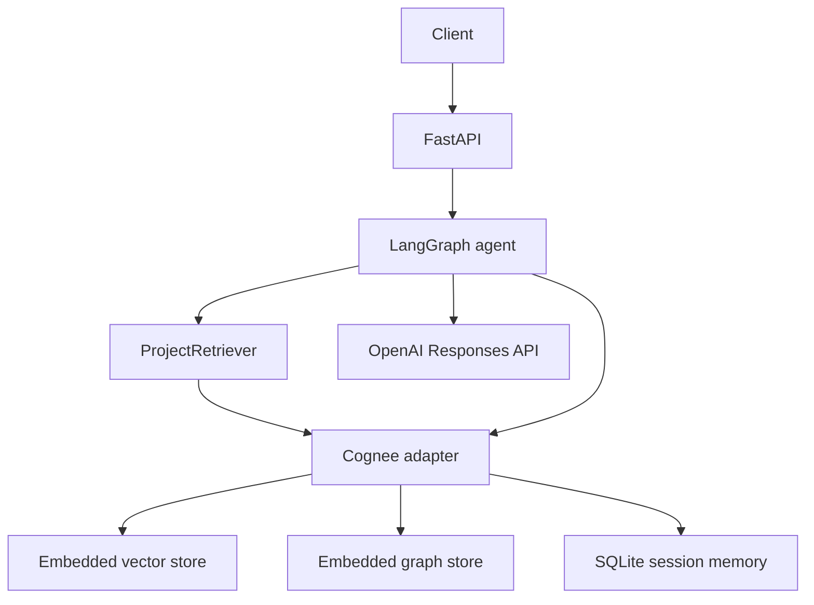

# Agentic Project Intelligence Platform

A small, explainable foundation for project-aware technical analysis. It ingests
project documents or a bounded view of a GitHub repository into Cognee, retrieves
semantic context, graph relationships, and project-scoped session memory, and runs a
single stateful LangGraph agent behind FastAPI.

This is intentionally **not** a generic chatbot and does not yet implement the three
domain workflows (review, investigation, impact analysis).

## Architecture



The application owns source normalization, retrieval coordination, orchestration,
and HTTP schemas. Cognee owns ingestion processing, embeddings, graph construction,
retrieval, and persistent memory. LangGraph owns state and graph execution.

Agent flow:

```text
understand -> retrieve -> reason -> (optional one refined retrieval)
           -> respond -> update project-scoped memory
```

No chain-of-thought is returned or stored. Only the visible question and answer are
written to Cognee session memory.

## Setup

Python 3.11 or 3.12 is recommended.

```bash
python -m venv .venv
source .venv/bin/activate          # Windows: .venv\Scripts\activate
pip install -e ".[dev]"
cp .env.example .env
```

Set `OPENAI_API_KEY` in `.env`. `OPENAI_MODEL` defaults to `gpt-5-mini` and can be
changed without code edits. The app forwards the key/model to Cognee when Cognee's
own `LLM_API_KEY`/`LLM_MODEL` variables are not explicitly set.

Cognee uses local SQLite, LanceDB, and Ladybug graph storage under
`.project_intelligence/`; no Neo4j or other service is required. The embedded stores
must be accessed by a single process, so use one Uvicorn worker.

## Ingest project data

From Markdown, TXT, or text-based PDF files:

```bash
project-intel ingest atlas --path ./examples/atlas/README.md --path ./examples/atlas/history.txt
```

From GitHub (public repositories work without `GITHUB_TOKEN`):

```bash
project-intel ingest atlas --github owner/repository
```

GitHub ingestion is deliberately bounded: repository metadata, README, ten recent
commits, the path tree, and at most 30 relevant source/config/documentation files.

The API accepts normalized inline documents:

```bash
curl -X POST http://localhost:8000/projects/atlas/ingest \
  -H "Content-Type: application/json" \
  -d '{
    "documents": [{
      "content": "Atlas uses FastAPI. Authentication uses JWT.",
      "file_name": "architecture.md",
      "document_type": "markdown",
      "source": "manual"
    }]
  }'
```

## Start the API

```bash
uvicorn app.main:app --reload
```

Or:

```bash
docker compose up --build
```

Health check: `GET http://localhost:8000/health`

## Chat example

```bash
curl -X POST http://localhost:8000/chat \
  -H "Content-Type: application/json" \
  -d '{
    "message": "How does Atlas handle authentication?",
    "project_id": "atlas",
    "session_id": "review-1"
  }'
```

Example response shape:

```json
{
  "answer": "Atlas uses JWT for authentication. [1]",
  "sources": ["architecture.md"],
  "retrieval": {
    "semantic_hits": 2,
    "graph_hits": 1,
    "memory_hits": 0
  }
}
```

## Tests

```bash
pytest
pytest --cov=app --cov-report=term-missing
```

The end-to-end test uses a deterministic in-memory test double and no network/API
key. It verifies ingestion, semantic retrieval, relationship retrieval, memory,
LangGraph execution, and both FastAPI endpoints with the Atlas fixture. Separate
adapter tests verify that application calls are translated to the current Cognee
`add`/`cognify`/`search`/`remember`/`recall` API correctly. Real Cognee/OpenAI runs
require credentials and are intentionally not part of the deterministic unit suite.

## Implemented

- Markdown, TXT, text-based PDF, inline, and bounded GitHub ingestion
- source/repository/path/type/timestamp metadata preservation
- thin `KnowledgeService` abstraction with Cognee implementation
- dataset-scoped semantic and graph-context retrieval
- project/session-scoped persistent Cognee memory
- combined retrieval interface
- stateful single-agent LangGraph with one bounded retry
- `/health`, `/projects/{project_id}/ingest`, and `/chat`
- Docker and deterministic end-to-end tests

## Known limitations

- Scanned PDFs need OCR and are rejected when no text can be extracted.
- GitHub ingestion does not clone repositories or parse every language.
- Cognee's graph completion context may not always expose original filenames in its
  structured result; filenames are also embedded in each normalized document.
- Embedded Cognee storage is suitable for a single-process local/demo deployment,
  not horizontally scaled workers.
- The current LangGraph checkpointer is process-local; durable project interaction
  memory is in Cognee. A durable LangGraph checkpointer can be added when resumable
  workflow execution becomes a requirement.

## Recommended Phase 2

1. Add a GitHub tool with explicit, read-only issue/PR/commit lookups (and MCP only
   where it simplifies those calls).
2. Implement **Issue Investigation** first as a typed LangGraph subgraph: classify,
   retrieve related code/docs/commits, form hypotheses, verify evidence, report.
3. Add evaluation fixtures for grounding, source attribution, and graph multi-hop
   retrieval before adding the other workflows.
4. Add Project Review, then Change Impact Analysis using the same shared retrieval
   and evidence models.
5. Add a persistent LangGraph checkpointer only when pause/resume or long-running
   workflows are introduced.
